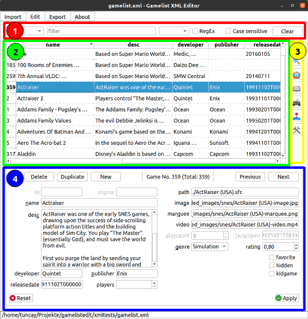

#   Gamelist XML Editor

GUI operation or commandline automation to edit, filter and export gamelist.xml files from EmulationStation.

- **Author**: Tuncay D.
- **License**: [GNU GPL v3](LICENSE)
- **Download**: [Github releases](https://github.com/thingsiplay/gamelistedit/releases)
- **Source**: [Github source](https://github.com/thingsiplay/gamelistedit)

## Introduction

Gamelist XML Editor allows for editing and filtering out data from [gamelist.xml](https://github.com/RetroPie/EmulationStation/blob/master/GAMELISTS.md) files. These files are databases used by [EmulationStation](https://retropie.org.uk/docs/EmulationStation/) in RetroPie to store game related meta information for each system, such as file paths or descriptions. Usually these files are created using [scraper tools](https://retropie.org.uk/docs/Scraper/) and manual editing should not be required. However there are times when it is needed, but editing such files in a text editor can be problematic. This program will only edit the database file itself without touching any associated files, such as ROMs or images. The user is responsible to sync up the files with all the changes made in the editor. It's a database editor, not a manager.

## First steps

There is a GUI (graphical user interface) and CLI (commandline interface) mode. Both use the same core, but some settings are only available through commandline options. The program comes as a barebones Python script, which expects Python and a few libraries already installed on the system. There is also a separate self contained *Linux-64Bit* bundle without any Python requirements and it comes with an install script too.The downside of this package is its huge filesize. Look at the bottom of the *README* for requirements and installation instructions.

Even converting a XML to XML with default settings will change the content, have these in mind:

- indentation is converted to 4 spaces (customize this with `--indent` or disable with `--no-indent`),
- game entries are sorted by name tag when filter is active, which is the default in `--no-gui` mode (customize this with `--sort` or disable with `--no-sort`),
- rearrangement of tags in a specific order (customize this with `--tag-order`),
- remove empty game entries and all tags with empty content (disable this with `--keep-empty`),
- encoding and escaping characters may have an incluence

## Usage GUI

At the moment there is no configuration file available and all settings are set through commandline options when calling the program. A few settings are available in the GUI itself and some are active at default. In example there are active options to hide tags, deactivate table columns and a default sort when starting the app. The interface is divided up into several tabs: only *Edit* and *Export* are described below.

### Edit Tab

1. **Filter**: Activate filter by simply typing something in the top bar. Only games matching the pattern will be displayed in the table. The word or pattern will be searched and compared against each tag (such as *name* and *desc*) for every game. If any match is found, then the game is included in the table display. It is possible to limit the comparison to a specific tag only by selecting one from the top left list. The list on the right side of search field is it's history. [Regular Expressions](http://doc.pyschools.com/html/regex.html) and case sensitivity can be enabled.
2. **Table**: The actual data of the "gamelist.xml" file converted to a visual table. Each row represents one game entry. The header are the actual tags (such as *name*) and the cell its content. Click on the header to sort all games. Double click any cell to edit this particular cell only. Some tags are protected and cannot be edited at default, other tags are even hidden (but not excluded). These behaviours can be disabled by using commandline options at launch: `--no-sort --no-lock --no-turnoff`
3. **Weblinks**: A little bonus panel with links to related websites and services. Clicking one of the buttons will generate a link on the fly based on current selected game entry and open it up in the default web browser. The topmost button in example will be only enabled, if there is an *id* and *source* available. It will then try to open the associated scraper service page. The other links contain search terms for use in YouTube, Wikipedia etc.
4. **Editor**: At default the game entry editor is collapsed. Click the "arrow" button on the left bottom to expand. In this view every tag content of currently selected game can be edited. **Caution**: Any changes made in the editor view are temporary and will be lost if the modifications are not accepted with *Accept* button on the right bottom. The *Reset* button on left bottom will undo all edits for the current game, even when coming back later.

### Export Tab

1. **File**: Path to the output file. If this is the same as input file, then it will simply overwrite it. If button *same as open file* is clicked (option `--no-same`) then path is set to same filename from current open file. Click again to make sure its not the same anymore, automatically adding a tail to it.
2. **Format**: Specifiy output format for exported file.
	* XML: Native format applicable for import, export and for usage in RetroPie/EmulationStation.
	* JSON: Alternative exchange format for export only, but capable of including all data.
	* CSV: Spreadsheet database for export only. Will only include game data and ignore other data.
	* TXT: Line separated data for export only. Will only include game data and ignore other data.
	* CFG: Line separated list of *path* content for export only. Usable as a custom-collection in RetroPie (note: relative paths needs to be converted to full path in that case).
3. **Options**: Settings and optional features when saving to file.
	* Apply Filter: Respect active filter and table sorting to export visible rows only. Without this option those effects are ignored and all game rows are saved in their original positioning in the output.
	* Exclude Tags: Select individual tags to exclude from writing to file. Without this option all tags in a game entry are written to output file.
    * Exclude Unsupported Tags: Do not export unknown tags, such as *folder*, *userrating*, *provider*. Write only supported game data.
    * Keep Empty: Do not remove empty game entries or tags without content. Some other options like excluding tags can result in such empty data. At default without this option only entries and tags with content in it are written to file.
	* Indent: Add indentation with spaces to each line or tag for visualizing the file structure in human redable way. This is file format dependent. For TXT files this setting generally means adding empty lines between games. Disabling this option will cause XML and JSON to become a single stream of data without additional newlines or indentation, but tag content itself (such as *desc*) can still contain newline characters when using XML format.

## Usage CLI (commandline)

The program have an alternate mode without graphical user interface. Use the `--no-gui` option to disable the GUI and message dialogs. Editing of individual game data is not possible and the main usage in this mode is just to filter and convert to desired format. There are some differences to the GUI operation described below. Use `--help` option to get an extensive list of options.

### stdout and stderror

If `--export` filename is *not* set, then the output will be written into *stdout* (printed to terminal). This could be used to pipe in into other programs *stdin* for further processing. The error messages and warnings are all written to *stderror*, not to *stdout* which contains data only. This means connecting with `|` "pipe" to other programs such as `grep` will only contain the actual table data output without error messages. But the messages are still printed out to the terminal.

### Apply Filter

When the option `--filter` or `--sort` is in use, then the other option `--apply-filter` will be activated automatically. Sorting is enabled by default and can be disabled with `--no-sort`.

### CommandLine Examples

Here are some commandline options with example output. The symbol `$` represents the terminal prompt and is not part of the command itself. If the lines get too long, then I will start using the short style of option names, such as `-G` instead of `--no-gui`, which is equivalent but less readable.

**Example 1**: Look for a file named "gamelist.xml" in folder "xmltests" of current working dir. Default automatic settings are in effect, especially the sorting of game entries by *name* tag. Write the output to a file "o.xml". Finally print informing and error message out, such as full path of processed files.

	$ ./gamelistedit.py --no-gui --import xmltests/gamelist.xml --export o.xml
	File successfully imported: /home/user/gamelistedit/xmltests/gamelist.xml
	File successfully exported: /home/user/gamelistedit/o.xml

**Example 2**: Using `--export` without filename argument for output, the export file will default to same name from `--import`. To prevent the file from overwriting, use `--no-same`. This will try to ensure adding a tail to the output filename, which is "_export.xml" at default. Use `--format` to change the file type and data format, in this example to CSV (comma separated values table). Note that the file extension will change automatically too. Without this format option, the file extension of export file will determine what format the output should have.

	$ ./gamelistedit.py -G --import xmltests/gamelist.xml --export --no-same --format csv
	File successfully imported: /home/user/gamelistedit/xmltests/gamelist.xml
	File successfully exported: /home/user/gamelistedit/xmltests/gamelist_export.csv

**Example 3**: Wildcards in filenames are supported, which expands to the first found file. This example searches for a file starting with "game" and ending with ".xml". Not specifying an export file will result in printing out the table content to the terminal without saving a file. Let's convert the output to unstructured text format using `-F` (which stands for `--format`) option. Do *not* indent or separate the lines by additional empty lines (`--no-indent`). Display only (`--filter`) games with a "mario" in the tag *name* (`--by` or `-b`). From this filtered game data, get and output the *name* tag content only using `-X` (stands for `--exclude-whitelist`) option. Supress any error messages (`--quiet` or `-q`), but allow critical messages.

	$ ./gamelistedit.py -G -q -i xmltests/game*.xml -F txt --no-indent -f mario -b name -X name
	Karoshi Mario
	Mario & Luigi: Kola Kingdom Quest
	Mario No Super Picross
	Mario Paint
	Mario To Wario
	Mario is Missing Done Right
	Mario's Journey Through Time & Space
	Super Mario 2D Land
	Super Mario All-stars
	Super Mario Arcade
	Super Mario Bros. 1X
	Super Mario Kart
	Super Mario Kart - Mario Kart R
	Super Mario Logic
	Super Mario Omega
	Super Mario Rpg - Legend Of The Seven Stars
	Super Mario World
	Super Mario World 2 - Yoshi's Island
	Super Mario World Odyssey
	Tetris And Dr. Mario

**Example 4**: This one is a bit more advanced, as it combines multiple programs through pipe. The format CFG is like TXT, but strict in some aspects. It will output *path* tags only without indentation. This structure is usable for custom-collection files in EmulationStation. Sometimes the path information are relative paths and need to be replaced by full paths to work as custom-collection. For this case the `sed` command will do the job.

In the following example we search for all games which have the string "/Mods/" in the *path*-tag. Take all these games and connect it to `grep` to get all lines with the word "World" in it. Connect this output again into another program called `sed` and replace every "./" with "/home/pi/RetroPie/roms/snes/". Then you can call it a day.

	$ ./gamelistedit.py -G -q -i xmltests/game*.xml -F cfg -f /Mods/ -b path | grep World | sed "s,./,/home/pi/RetroPie/roms/snes/,"
	/home/pi/RetroPie/roms/snes/Mods/Brave New World.smc
	/home/pi/RetroPie/roms/snes/Mods/Super Mario World Odyssey (Beta 1).smc
	/home/pi/RetroPie/roms/snes/Mods/Toads World.smc

## Installation

Currently only GNU+Linux is supported, no Windows or Mac support. The program and scripts are designed around the tools and scripting capabilities in Linux and is tested under Ubuntu only.

The program is written in Python and requires a Python 3 environment plus *PyQt 5* and *xmltodict* modules. The distributed archive have the naming scheme "gamelistedit-0.1.0.tar.gz". There is another option, a compiled/packaged archive which does not require any Python or modules. It comes with everything builtin, but is huuuge in its size (almost 170 MB, compared to the less than 400 KB of the Python version). It comes with an install script as well. This package has a naming scheme like "gamelistedit-0.1.0-Linux-64Bit.tar.gz". The third option to run the application is downloading the source itself. Compared to the Python distribution version it will contain additional files and requirements to build the archives.

## Minimal Requirements

System requirements when running Python version directly:

- Python: 3.6
- PyQt5 (Python module): 5.15
- xmltodict (Python module): 0.12

Additional requirements when building standalone distribution files from source:

- PyInstaller: 4.0
- pyuic5: 5.15
- Pandoc: 1.19

### Install script for compiled standalone version:

The application basically contains the entire Python and Qt5 environment and do not need any of the libraries. It brings an optional installer script, which can be used to install the application into "/opt/gamelistedit", the link file to "/usr/local/bin/gamelistedit" and desktop files to "$HOME/.local/share/applications". Off course the install script requires root rights. It will make the application available at the commandline indipendent from current directory. Also GNOME and KDE detects the desktop files and makes them available in the menu under the category *Utility*.

### Make script for source version:

If you decide to download the original source code, then you will need to build the UI first. Just use `make` command, which will test for some dependencies and and create the program UI and HTML version of this README. `make all` will create everything, including the compiled version and both distribution archives. `make install` will call the install script for the compiled version. Use `make clean` to delete temporary files. Look into `make help` for an overview of subcommands.

## Known bugs, limitations and quirks

All unsolved and known mysteries of the program, when it behaves unexpected or in a very specific way are collected here.

- **unsupported tags**: There are other tags and group of tags not supported by this program and handled differently depending on the format. Look down to read more about that.

- **stdin**: The program can write to *stdout* and *stderror*, but cannot read from *stdin*. This limitation could be solved in the future, but for now it is what it is.

- **no-same**: The option `--no-same` does not work initially, if no filename was given at start with `--import`. Because the check is done before any user interaction, even before the file select dialog. Although this does not matter much in GUI mode, as the user can change this setting afterwards in *Export* tab.

### Unsupported Tags

Generally speaking the program tries to be compliant to the [RetroPie GAMELIST format](https://github.com/RetroPie/EmulationStation/blob/master/GAMELISTS.md). It's main purpose is to edit and write *game*-tags. The *folder*-tags are also part of the specification, but cannot be edited. They are preserved as they are only in XML and JSON output format and written back when exported. Any *folder*-tags and its data will be excluded by invoking the option `--exclude-unsupported`.

Some scraper or programs write additional tags and data not part of this specification. These could be higher level tags next to *game* and *folder*, in example *provider*. Such data will be preserved as they are and written back to the exported file, if not excluded via `--exclude-unsupported` option. Also these higher level tags are only written to XML and JSON files and ignored by the other formats. Then there are unsupported tags in *game* data, such as *userrating* or *genres* with multiple *genre*-entries. These will be preserved and written to the final export file for **all** formats (except CFG).

The program tries its best to support unsupported tags, but their order in final output may differ. Usually they should appear on the bottom within its context.

## Feedback

If you want report a bug or have any questions, then [leave me a message](https://thingsiplay.game.blog/contact/) on my contact page.

## Changelog

### Version 0.1

- initial release

